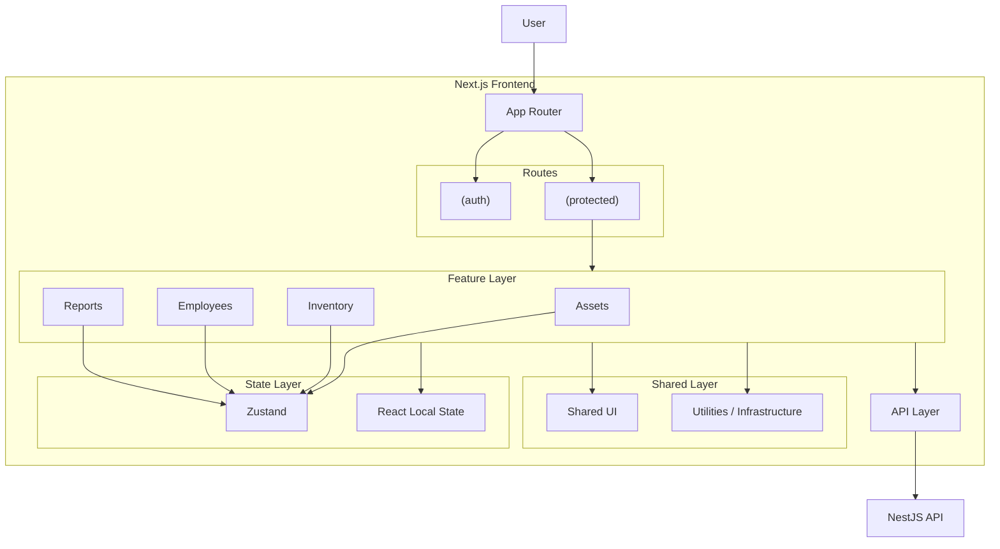
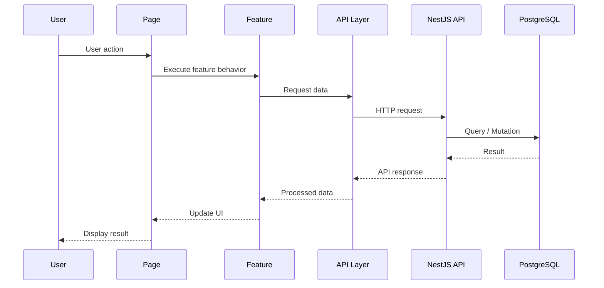
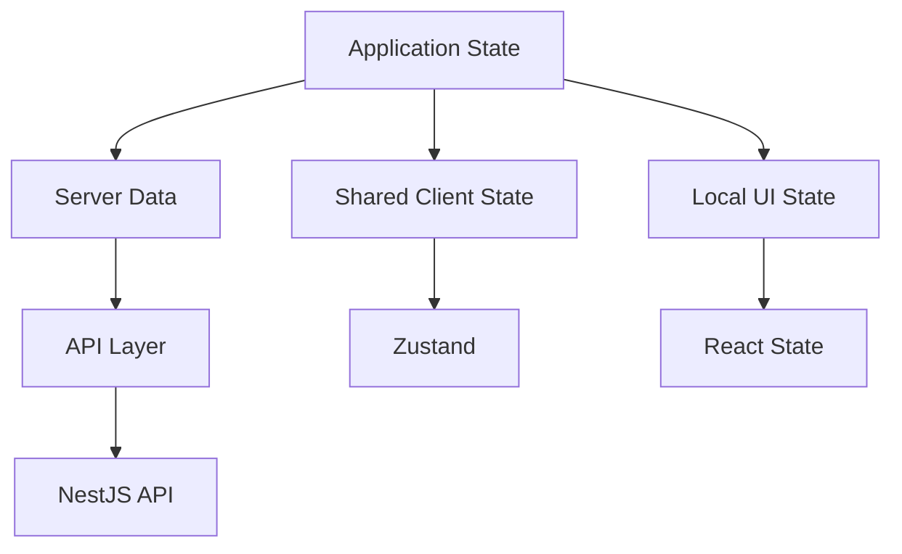
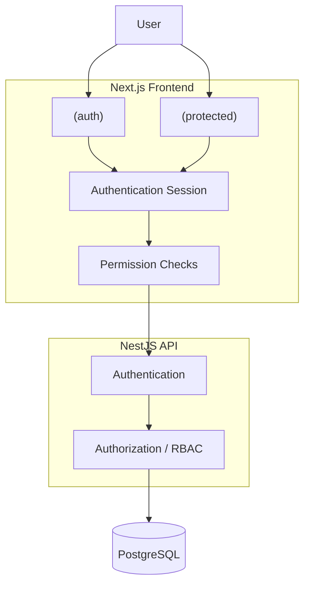

[← Back to Root Documentation](../README.md)

# Frontend Architecture

Documentation for the Frontend Architecture.

<details>
<summary>Table of Contents</summary>

- [Overview](#overview)
- [Architectural Model](#architectural-model)
- [Application Boundaries](#application-boundaries)
- [Request & Data Flow](#request--data-flow)
- [State Architecture](#state-architecture)
- [Authentication & Authorization Boundary](#authentication--authorization-boundary)
- [Architectural Principles](#architectural-principles)

</details>

---

## Overview

The IT Management System frontend is a feature-oriented web application built with Next.js App Router and React.

The architecture separates routing, feature logic, shared UI, application state, and API communication into distinct responsibilities.

The frontend communicates with the NestJS backend through a centralized API layer and uses Zustand for client-side application state management.

---

## Architectural Model



---

## Application Boundaries

The frontend is organized into distinct responsibilities. Each layer should have a clear purpose and should avoid taking responsibility from another layer.

| Boundary                   | Responsibility                                                 |
| -------------------------- | -------------------------------------------------------------- |
| App Router                 | Routes, layouts, navigation, and route composition             |
| Features                   | Feature-specific UI, business logic, and workflows             |
| Shared Components          | Reusable UI components without feature-specific business logic |
| Zustand                    | Application and shared client state                            |
| React State                | Local component state                                          |
| API Layer                  | Communication between the frontend and backend                 |
| Utilities / Infrastructure | Shared technical utilities and application infrastructure      |

### Dependency Direction

The preferred dependency direction is:

```text
App Router
    ↓
Features
    ↓
API / State / Shared Components
    ↓
Backend API
```

> [!NOTE]
> Features may use shared components, Zustand stores, and the API layer. Shared components should not depend on feature-specific business logic. The API layer should not contain UI concerns.

---

## Request & Data Flow

The frontend communicates with the backend through a centralized API layer.

A typical request follows this flow:



### Request Direction

Frontend requests should follow:

```text
Component
    ↓
Feature
    ↓
API Layer
    ↓
NestJS API
    ↓
PostgreSQL
```

> [!IMPORTANT]
> Components should not directly communicate with the backend.

API communication should remain centralized so that authentication, error handling, request configuration, and response handling can be managed consistently.

### Data Ownership

Data should remain close to the layer that owns it.

- Backend owns persistent business data.
- Zustand owns shared client-side application state.
- Components own temporary local UI state.
- The API layer owns communication concerns.

---

## State Architecture

The application uses Zustand as the application-level state management solution.

State is separated according to its scope and responsibility.



### State Ownership

| State Type          | Solution    | Examples                                                   |
| ------------------- | ----------- | ---------------------------------------------------------- |
| Server Data         | API Layer   | Assets, employees, inventory, reports                      |
| Shared Client State | Zustand     | User session, preferences, shared filters, selections      |
| Local UI State      | React State | Modal visibility, temporary form state, local interactions |

### Zustand

> [!NOTE]
> Zustand is used for client-side state that needs to be shared across components or features.

Stores should be organized according to responsibility rather than creating one large global store.

```text
stores/
├── auth.store.ts
├── app.store.ts
├── ui.store.ts
├── asset.store.ts
└── inventory.store.ts
```

Feature-specific state should remain within the feature when it does not need to be shared globally.

### Local State

State that is only required by a single component should remain local.

```text
Component-specific state
    ↓
React useState / useReducer
```

> [!WARNING]
> Avoid moving local state into Zustand without a clear need.

### State Principles

- Use the smallest appropriate state scope.
- Avoid duplicating the same state across multiple stores.
- Do not use Zustand as a replacement for backend persistence.
- Keep server-owned data conceptually separate from client-owned state.
- Keep feature-specific state close to the feature that owns it.

---

## Authentication & Authorization Boundary

> [!NOTE]
> Authentication and authorization are separate concerns.

Authentication determines whether the user is authenticated.

Authorization determines what the authenticated user is allowed to access or perform.



### Authentication

> [!NOTE]
> Unauthenticated users are directed to authentication routes.

```text
(auth)
├── login
├── forgot-password
└── reset-password
```

> [!NOTE]
> Authenticated application routes are grouped under:

```text
(protected)
├── dashboard
├── assets
├── inventory
├── employees
├── reports
└── settings
```

Route groups are organizational boundaries and do not appear in the URL.

### Authorization

The frontend uses permissions to control:

- Navigation visibility
- Page access
- Feature availability
- User actions
- Create / update / delete controls

> [!IMPORTANT]
> Frontend authorization is **not the final security boundary**.

The backend must independently authenticate requests and enforce roles and permissions before performing protected operations.

```text
Frontend Permission Check
            ↓
      User Experience
            ↓
  Backend Authorization
            ↓
    Security Boundary
```

---

## Architectural Principles

### 1. Keep Features Self-Contained

Feature-specific business logic should remain within the feature that owns it.

### 2. Keep Pages Thin

Pages should primarily compose layouts and feature components.

### 3. Prefer Clear Boundaries

Each layer should have a clear responsibility and should not perform work belonging to another layer.

### 4. Use the Smallest State Scope

Prefer local React state for local concerns and Zustand only when state needs to be shared.

### 5. Centralize API Communication

Components and pages should not directly implement backend communication.

### 6. Shared Means Genuinely Shared

Do not move feature-specific code into shared modules simply for convenience.

Code should become shared when there is a meaningful reuse requirement.

### 7. Backend Is the Security Boundary

Frontend authentication and permission checks improve the user experience, but backend authorization is responsible for enforcing access control.

### 8. Avoid Unnecessary Abstraction

Prefer simple, explicit solutions over abstractions introduced for hypothetical future requirements.

### 9. Keep Dependencies Predictable

Dependencies should generally flow from the application and features toward shared infrastructure, rather than creating circular dependencies between features.

### 10. Architecture Should Evolve Deliberately

Architectural changes should be intentional and documented when they affect major application boundaries, state ownership, security, or development patterns.

---

> [!TIP]
> This document defines the frontend's architectural direction. Detailed implementation guidance belongs in the related documentation, such as state management, API integration, authentication, authorization, testing, and folder structure.

### What Does Not Belong Here?

The following topics should be documented separately:

```text
How to create a Zustand store
How to create an API endpoint
How to name components
Exact folder naming rules
How to write tests
How login token refresh works internally
```
